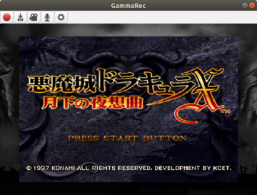

# GammaRec

GammaRec is a video capture recording and preview utility. The main use case
is recording a feed from a capture device while compositing the source into
a stream layout using window capture or streaming software such as
[OBS](https://obsproject.com).



## Install

GammaRec is written in Python and relies heavily on Gtk and Gstreamer. You
may need to install some prerequisites depending on your distribution:

```shell
$ sudo apt-get install gstreamer1.0-libav gstreamer1.0-gtk3 python3 python3-pip
$ pip3 install gammarec
```

To run GammaRec, just launch the desktop entry, or run from command line:

```shell
$ gammarec
```

## Wayland

GammaRec supports native Wayland rendering via its fallback element,
`gtksink`, however, performance takes a hit and you will not be able to
window capture using OBS's `xcomposite` plugin. As a workaround, the desktop
entry launches in backward compatibility mode. If you are launching from
command line, the same behavior can be acheived by setting the
`WAYLAND_DISPLAY` environment variable to `x11`:

```shell
$ WAYLAND_DISPLAY=x11 gammarec
```

## Lossless encoding

GammaRec supports lossless encoding for both video and audio.

To enable lossless video encoding, open the encoding options dialog and set the
`Target` to `quality` and the `Quantizer` to `0`. You do not need to specify a
value for the `Bitrate` field.

To enable lossless audio encoding, set the `Audio codec` to `pcm`. You do not
need to specify a value for the `Audio bitrate` field.
